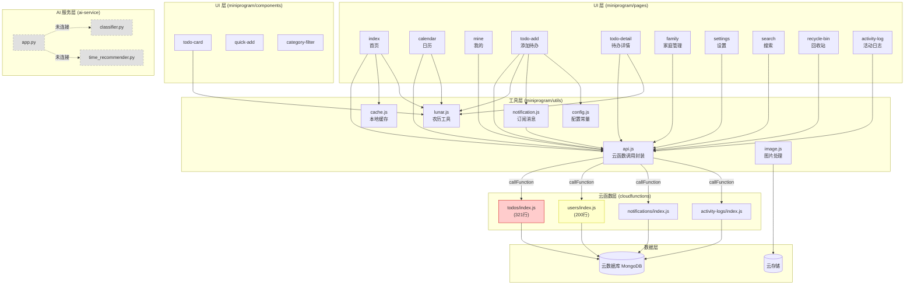

# 架构分析与批判

## 1. 架构模式识别

### 模式类型：Serverless 分层架构 + 独立微服务

本项目采用 **微信小程序云开发（Serverless）** 架构，辅以一个独立的 AI 微服务。整体结构可分为五个层次：

| 层级 | 技术选型 | 职责 |
|------|----------|------|
| UI 层 | miniprogram/pages + components | 页面渲染、用户交互 |
| API 封装层 | miniprogram/utils/api.js | 统一封装云函数调用 |
| 业务逻辑层 | cloudfunctions/* | 待办/用户/通知/日志的 CRUD |
| 数据层 | 微信云数据库（MongoDB） | 持久化存储 |
| AI 服务层 | ai-service/ (FastAPI) | 文本分类、时间推荐（未集成） |

**判定结论**：属于 **分层架构（Layered Architecture）**，但存在层级模糊和未完成模块的问题。

---

## 2. 模块依赖关系图



> 红色 = God Object 警告（>200行），黄色 = 边界值（200行），灰色虚线 = 未集成模块

---

## 3. 层级分析

### 3.1 层级清晰度评估

| 层级边界 | 状态 | 说明 |
|----------|------|------|
| UI -> API 封装层 | 良好 | 所有页面均通过 `api.js` 调用云函数，无直接 `wx.cloud.callFunction` 散落 |
| API 封装层 -> 云函数 | 良好 | `api.js` 统一入口，按 action 路由 |
| 云函数 -> 数据库 | 良好 | 云函数内直接操作 `db.collection()`，符合云开发惯例 |
| UI -> 全局状态 | 存在问题 | 多个页面直接读写 `app.globalData`，无状态管理层 |
| AI 服务 <-> 主应用 | 断裂 | AI 服务完全独立，无任何调用链路 |

### 3.2 层级违规（Cross-Layer Calls）

未发现严重的跨层调用。所有页面均通过 `utils/api.js` 访问云函数，未绕过封装层直接调用底层。

### 3.3 各层代码量分布

| 层级 | JS 文件数 | 总行数 | 占比 |
|------|----------|--------|------|
| 页面层 (pages) | 10 | ~690 | 21% |
| 组件层 (components) | 3 | ~68 | 2% |
| 工具层 (utils) | 4 | ~206 | 6% |
| 云函数层 (cloudfunctions) | 4 | ~680 | 21% |
| AI 服务层 (ai-service) | 3 | ~170 | 5% |
| 样式文件 (wxss) | 10 | ~710 | 22% |
| 模板文件 (wxml) | 10 | ~525 | 16% |
| 配置/其他 | - | ~240 | 7% |

---

## 4. God Object 识别

### 4.1 超过 200 行的文件

| 文件 | 行数 | 问题描述 |
|------|------|----------|
| `cloudfunctions/todos/index.js` | **321** | 承载 13 个 action 的全部 CRUD 逻辑 + 活动日志记录，职责过多 |
| `cloudfunctions/users/index.js` | **200** | 8 个 action，每个函数重复 `getUserAndFamily` 模式 |

### 4.2 接近阈值的文件

| 文件 | 行数 | 风险 |
|------|------|------|
| `miniprogram/pages/todo-add/todo-add.js` | 179 | 表单处理逻辑集中，暂可接受 |
| `miniprogram/components/todo-card/todo-card.wxss` | 157 | 样式文件，正常 |

---

## 5. 关键架构问题

### 5.1 云函数内的 switch-case 路由反模式

所有 4 个云函数均采用相同的 `switch(action)` 路由模式，每个函数入口都包含：
```javascript
const cloud = require('wx-server-sdk')
cloud.init({ env: cloud.DYNAMIC_CURRENT_ENV })
const db = cloud.database()
const _ = db.command
const wxContext = cloud.getWXContext()
const openid = event._testOpenid || wxContext.OPENID
```
这段初始化代码在 4 个文件中完全重复，且每个云函数都是一个包含所有相关操作的"单体函数"。

### 5.2 业务逻辑与日志记录耦合

`cloudfunctions/todos/index.js` 中，`logActivity()` 直接内联在每个 CRUD 操作中。活动日志记录不是可选的、可配置的，而是硬编码在业务流程中。

### 5.3 重复的用户查找模式

`cloudfunctions/users/index.js` 中，以下模式重复了 **8 次**：
```javascript
const user = await db.collection('users').where({ openid }).get()
if (user.data.length === 0) return { code: -1, msg: 'User not found' }
```
`cloudfunctions/todos/index.js` 中通过 `getUserAndFamily()` 做了部分抽象，但 users 云函数本身没有。

### 5.4 配置数据散落多处

分类（category）、颜色（color）、重复选项（repeat）等枚举值在以下位置重复定义：
- `miniprogram/pages/todo-add/todo-add.js`（data 字段）
- `miniprogram/pages/todo-detail/todo-detail.js`（categoryMap, repeatMap）
- `miniprogram/components/category-filter/category-filter.js`（categories）
- `ai-service/models/classifier.py`（keywords, categories）
- `ai-service/config.py`（CATEGORIES, COLORS）

### 5.5 AI 服务完全未集成

`ai-service/` 目录包含完整的 FastAPI 服务（文本分类、时间推荐），但：
- 没有云函数调用它
- 没有小程序端调用它
- `config.ENABLE_AI` 默认为 `false`
- 没有任何集成文档或调用链路

### 5.6 缓存层形同虚设

`utils/cache.js` 提供了完整的缓存能力，但仅在 `pages/index/index.js` 的 `loadTodos()` 中使用了一次（`cache.set('today_todos', res.data)`），且从未调用 `cache.get()` 来读取缓存。

### 5.7 全局状态管理缺失

`app.globalData` 是唯一的全局状态载体，但：
- 无响应式机制，页面无法自动感知变化
- `waitForLogin()` 使用 `setInterval` 轮询（100ms），属于低效模式
- 多个页面直接读写 `globalData.userInfo`，无统一的状态同步

---

## 6. 重构路线图

### 低优先级（Low Priority）

| # | 项目 | 描述 | 预期收益 |
|---|------|------|----------|
| L1 | **提取公共配置常量** | 将 category、color、repeat 等枚举值集中到 `miniprogram/constants.js`，页面/组件/云函数统一引用 | 消除 5 处重复定义，修改时只需改一处 |
| L2 | **补全缓存层使用** | 在 `loadTodos` 中补充 `cache.get()` 读取逻辑，在其他高频页面（calendar）也引入缓存 | 减少云函数调用次数，提升首屏速度 |
| L3 | **云函数日志标准化** | 统一 4 个云函数的错误返回格式和日志输出方式，增加请求 traceId | 便于线上问题排查 |

### 中优先级（Medium Priority）

| # | 项目 | 描述 | 预期收益 |
|---|------|------|----------|
| M1 | **提取云函数公共模块** | 将 `cloud.init`、`openid` 解析、用户查找等重复代码提取为 `cloudfunctions/shared/` 公共模块 | 消除 4 个文件中的重复初始化代码 |
| M2 | **拆分 todos 云函数** | 将 321 行的 `todos/index.js` 按职责拆分为：`todos-crud`（创建/更新/删除）、`todos-query`（查询/搜索）、`todos-lifecycle`（完成/恢复） | 降低单文件复杂度，便于独立测试 |
| M3 | **活动日志解耦** | 将 `logActivity()` 从 todos 云函数中剥离，改为事件驱动或独立调用，使 CRUD 操作与日志记录解耦 | todos 云函数减约 60 行，日志策略可独立调整 |
| M4 | **引入简易状态管理** | 在 `app.js` 中实现基于事件总线的简单状态管理（如 `EventBus`），替代直接读写 `globalData` | 页面间状态同步更可靠，减少 `waitForLogin` 轮询 |

### 高优先级（High Priority）

| # | 项目 | 描述 | 预期收益 |
|---|------|------|----------|
| H1 | **消除 users 云函数重复代码** | 将 `users/index.js` 中重复 8 次的用户查找模式提取为内部函数 `findUserByOpenid(openid)` | 减少约 40 行重复代码，降低维护出错概率 |
| H2 | **AI 服务集成或清理** | 二选一：(a) 在 `todos` 云函数或小程序端接入 AI 分类/推荐，激活已有代码；(b) 如果短期不集成，移除 `ai-service/` 目录或标记为实验性模块 | 减少"死代码"带来的维护困惑 |
| H3 | **waitForLogin 改用 Promise 化方案** | 将 `app.js` 中的 `setInterval` 轮询改为基于回调/Promise 的就绪通知机制（如 `app.onReady(callback)`） | 消除 100ms 轮询开销，代码语义更清晰 |

---

## 7. 总结

### 架构优势
- **API 封装层设计良好**：`utils/api.js` 统一了所有云函数调用，页面层无直接云调用散落
- **无循环依赖**：模块间依赖方向清晰，无反向引用
- **组件化合理**：`todo-card`、`quick-add`、`category-filter` 三个组件职责单一

### 架构风险
- **todos 云函数是 God Object**（321 行，13 个 action），随功能增长将成为维护瓶颈
- **AI 服务是孤立模块**，投入了开发成本但未产生价值
- **配置数据散落 5 处**，任何枚举变更都需要同步修改多个文件
- **缓存层写了但几乎没用**，属于未完成的优化

### 风险等级：中等
项目整体架构方向正确，分层清晰，主要问题集中在云函数层的代码组织和未完成的功能模块。按上述路线图逐步重构即可，无需大规模架构调整。
